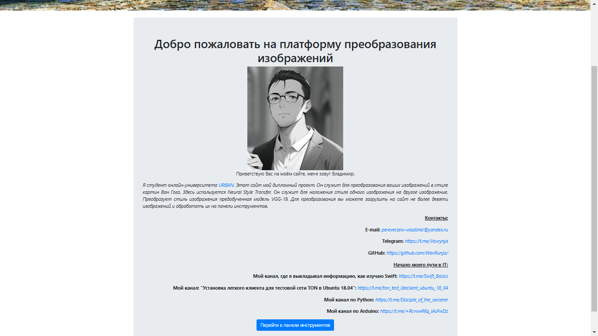
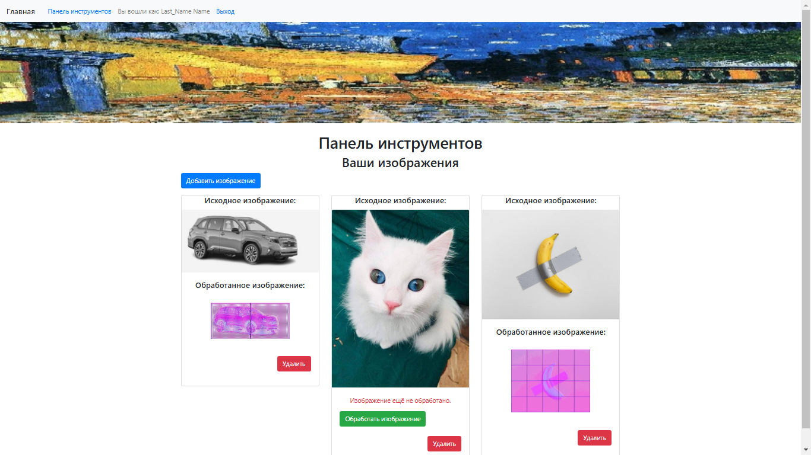
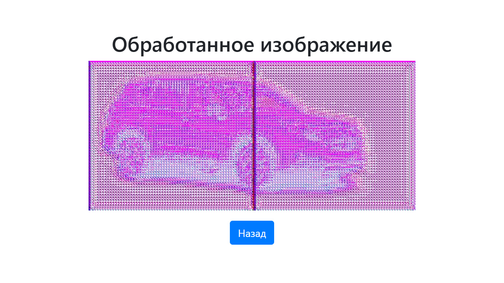
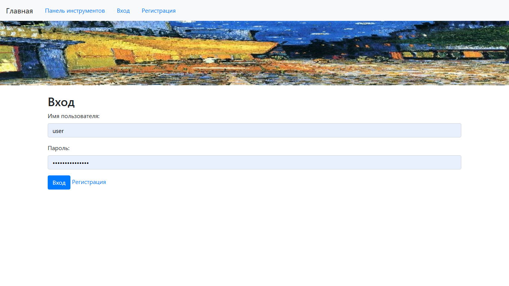
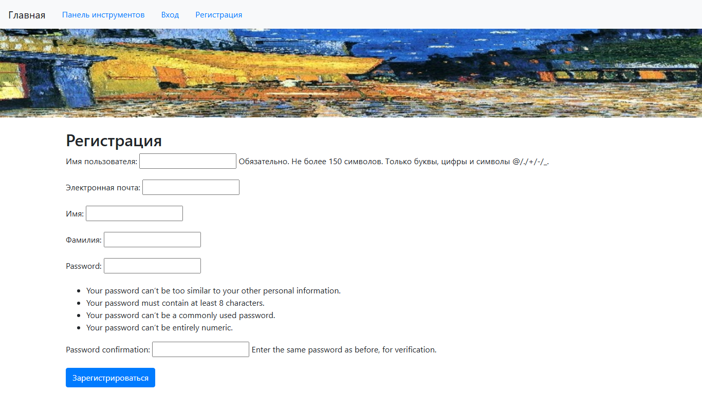

# **Обзор проекта**

Данный проект представляет собой веб-приложение на базе Django, предназначенное для преобразования загруженных пользователями изображений в заданный стиль, используя модели нейронных сетей. Приложение предоставляет пользователям интуитивно понятный интерфейс, возможности загрузки изображений, их обработки и просмотра результатов. Для преобразования используется модель **AnimeGAN**, которая преобразует изображения в стиль аниме.

## **Основные функции:**
1. Регистрация и авторизация пользователей.
2. Загрузка изображений и просмотр галереи загруженных файлов.
3. Преобразование изображений в другой стиль с помощью предобученной модели.
4. Просмотр обработанных изображений.
5. Удаление изображений и их результатов обработки.

## **Особенности:**

* **Bootstrap** используется для создания удобного интерфейса.
* Поддерживаются авторизация и привязка изображений к конкретным пользователям, что обеспечивает конфиденциальность.
* Приложение обеспечивает ограничение количества загружаемых изображений на пользователя.

## **Структура проекта**

Проект состоит из следующих ключевых компонентов:
* **Домашняя страница**: содержит приветственное сообщение и ссылки на основные разделы (регистрация, вход, панель инструментов).
* **Панель инструментов**: место для загрузки, обработки и управления изображениями пользователя.
* **Страница авторизации**: позволяет входить в существующую учетную запись или зарегистрировать новую.

## **Файловая структура проекта**

```
Project/
├── .venv/                # Виртуальное окружение
├── locale/               # Локализации
├── media/                # Файлы пользователя
│    ├── default/         # Изображения по умолчанию
│    ├── images/          # Загрузки пользователей
│    └── processed_images/ # Обработанные изображения
├── modify_objects/       # Основное приложение
│    ├── gan_models/      # Модели и веса нейросетей
│    ├── migrations/      # Миграции базы данных
│    ├── templates/       # HTML-шаблоны
│    └── utils.py         # Логика обработки изображений
├── modifying_site/       # Конфигурация Django
├── static/               # Статические файлы
├── templates/            # Глобальные шаблоны
├── db.sqlite3            # База данных SQLite
├── manage.py             # Управление проектом
└── requirements.txt      # Список зависимостей
```

## **Домашняя страница**

На главной странице (Рисунок 1.) отображается краткое приветствие и кнопка для перехода на Панель инструментов. Пользователь, не авторизованный в системе, перенаправляется на страницу входа при попытке зайти в Панель инструментов.
 


_Рисунок 1. Домашняя страница._

## **Панель инструментов**

**Панель инструментов** — основной рабочий инструмент пользователя (Рисунок 2.), включающий следующие функции:
* Загрузка изображений.
* Просмотр миниатюр загруженных изображений.
* Обработка изображений преобразование в другой стиль.
* Просмотр обработанных изображений (Рисунок 3.).
* Удаление загруженных и обработанных файлов.

### **Ограничения:**

* Максимум 9 изображений на одного пользователя.
* Загруженные изображения масштабируются до квадрата и разделяются на части для более точной обработки.


 
_Рисунок 2. Панель инструментов._


 
_Рисунок 3. Обработанное изображение._

## **Страница авторизации**

Система аутентификации поддерживает:

* **Вход**: позволяет зарегистрированным пользователям получить доступ к своим изображениям (Рисунок 4.).
* **Регистрация**: создание нового аккаунта (Рисунок 5.).

Доступ к обработке изображений возможен только после авторизации.



_Рисунок 4. Вход._



_Рисунок 5. Регистрация._

## **Шаблоны страниц**

Проект использует шаблонную систему Django для отображения страниц:

* **base_generic.html**: базовый шаблон с подключением Bootstrap.
* **home.html**: домашняя страница.
* **dashboard.html**: управление загруженными изображениями.
* **login.html**: вход в систему.
* **register.html**: регистрация.

## **Примечания:**

1. Для преобразования фотографий на сайте используется модель AnimeGAN, которая преобразует изображения в стиле аниме. Для работы с проектом применяются фреймворки TensorFlow и PyTorch.
2. В проекте используются веса модели Hayao-64.ckpt (стиль аниме, на основе работ Хаяо Миядзаки). Эти веса, изначально подготовленные для TensorFlow (.ckpt), были конвертированы в формат PyTorch (.pth). Однако из-за несоответствия форматов весов конвертация некорректна. Для исправления данной проблемы требуется глубокое изучение процесса преобразования весов между TensorFlow и PyTorch.
3. Из-за ограничения модели на обработку изображений размером 256×256 пикселей загружаемые изображения разбиваются на квадраты соответствующего размера. Каждый квадрат обрабатывается отдельно, после чего квадраты собираются обратно в единое изображение. Этот подход приводит к возникновению видимой сетки на изображении из-за обработки границ квадратов. Решение этой проблемы требует доработки алгоритма.
4. Для обеспечения стабильной работы необходимо установить ограничения на количество (максимум 9 изображений на пользователя) и размеры загружаемых пользователями изображений.
5. Модель AnimeGAN можно заменить. Для этого в проекте уже подготовлен альтернативный подход. Достаточно переименовать файл utils_new.py в utils.py. В данном файле используется библиотека torchvision с предобученными моделями для Neural Style Transfer. Применяется модель VGG-19, которая преобразует изображения в выбранный стиль.

## **Заключение**

Разработанное приложение предоставляет пользователям удобный инструмент для обработки и преобразования стиля изображений. Оно сочетает в себе мощь современных моделей машинного обучения и доступность через веб-интерфейс. Проект может быть расширен за счет интеграции дополнительных моделей.

## Приложение 1. Пример файловой структуры проекта:

```
Project/
├── .venv/ library root
├── locale/
├── media/
│    ├── default/
│    │    └── default.png
│    ├── images/
│    └── processed_images/
├── modify_objects/
│    ├── gan_models/
│    │    ├── anime_gan/
│    │    │    ├──Hayao-64/
│    │    │    │   ├── Hayao-64.ckpt.data-00000-of-00001
│    │    │    │   ├── Hayao-64.ckpt.index
│    │    │    │   └── Hayao-64.ckpt.meta
│    │    │    ├──Hayao-99/
│    │    │    │   ├── Hayao-99.ckpt.data-00000-of-00001
│    │    │    │   ├── Hayao-99.ckpt.index
│    │    │    │   └── Hayao-99.ckpt.meta
│    │    │    ├──Paprika-98/
│    │    │    │   ├── Paprika-98.ckpt.data-00000-of-00001
│    │    │    │   ├── Paprika-98.ckpt.index
│    │    │    │   └── Paprika-98.ckpt.meta
│    │    │    └──Shinkai-33/
│    │    │        ├── Shinkai-33.ckpt.data-00000-of-00001
│    │    │        ├── Shinkai-33.ckpt.index
│    │    │        └── Shinkai-33.ckpt.meta
│    │    ├── animegan.pth
│    │    ├── animegan.py
│    │    ├── animegan-64.pth
│    │    ├── animegan-98.pth
│    │    ├── animegan-99.pth
│    │    └── convert_to_pth.py
│    ├── migrations/
│    │    ├── 0001_initial.py
│    │    └── __init__.py
│    ├── __init__.py
│    ├── admin.py
│    ├── apps.py
│    ├── forms.py
│    ├── models.py
│    ├── tests.py
│    ├── urls.py
│    ├── utils.py
│    ├── utils_new.py
│    └── views.py
├── modifying_site/
│    ├── __init__.py
│    ├── asgi.py
│    ├── settings.py
│    ├── urls.py
│    └── wsgi.py
├── static/
│    └── images/
│         └── favicon.ico
├── templates/
│    └── modify_objects/
│         ├── add_image_feed.html
│         ├── base_generic.html
│         ├── dashboard.html
│         ├── home.html
│         ├── login.html
│         └── register.html
├── .gitignore
├── db.sqlite3
├── manage.py
└── requirements.txt
```

## Приложение 2. Список необходимых библиотек

```
absl-py==2.1.0
asgiref==3.8.1
astunparse==1.6.3
certifi==2024.8.30
charset-normalizer==3.4.0
Django==5.0.4
filelock==3.13.1
flatbuffers==24.3.25
fsspec==2024.2.0
gast==0.6.0
google-pasta==0.2.0
grpcio==1.68.0
h5py==3.12.1
idna==3.10
Jinja2==3.1.3
keras==3.6.0
libclang==18.1.1
Markdown==3.7
markdown-it-py==3.0.0
MarkupSafe==3.0.2
mdurl==0.1.2
ml-dtypes==0.4.1
mpmath==1.3.0
namex==0.0.8
networkx==3.2.1
numpy==1.26.4
opencv-python-headless==4.9.0.80
opt_einsum==3.4.0
optree==0.13.1
packaging==24.2
pillow==10.3.0
protobuf==5.28.3
Pygments==2.18.0
requests==2.32.3
rich==13.9.4
setuptools==75.6.0
six==1.16.0
sqlparse==0.5.0
sympy==1.13.1
tensorboard==2.18.0
tensorboard-data-server==0.7.2
tensorflow==2.18.0
tensorflow_intel==2.18.0
termcolor==2.5.0
torch==2.5.1+cu118
torchaudio==2.5.1+cu118
torchvision==0.20.1+cu118
typing_extensions==4.11.0
tzdata==2024.1
urllib3==2.2.3
Werkzeug==3.1.3
wheel==0.45.1
wrapt==1.17.0
```
